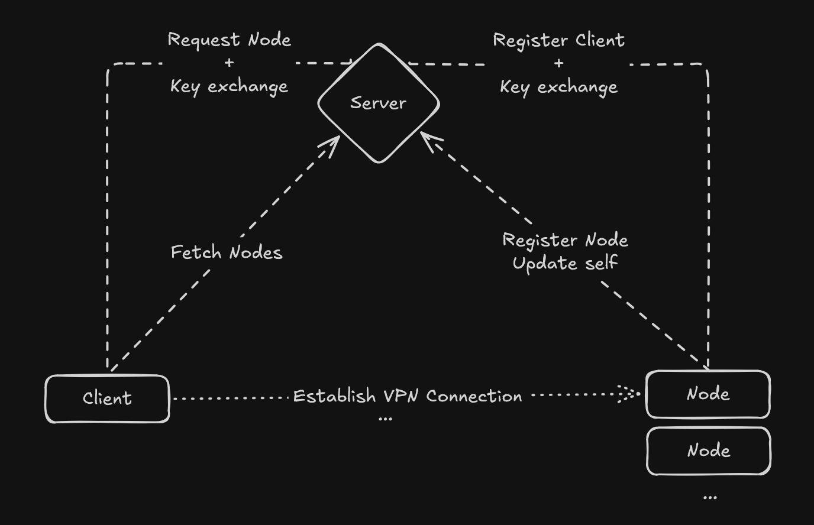

<p align="center">
  
</p>

<p align="center">
    
    <a href="https://ko-fi.com/1TheCrazy">
        
    </a>
    
</p>

# Tunnel
Tunnel is a lightweight WireGuard-based private VPN platform for managing and connecting to a network of distributed proxy nodes.

- [Features](#features)
- [Installation Guide](#installation-guide)
- [CLI Guide](#cli)
- [GUI Guide](#gui)
- [How it works](#how-it-works)
- [Troubleshooting](#troubleshooting)
- [Work In Progress](#wip)
- [Contributing](#contributing)

## Features
> Tunnel is a lightweight private VPN platform for managing and connecting to a network of distributed proxy nodes.

What now?<br>
If this doesn't mean anything to you, you can imagine Tunnel as a framework for managing **your private VPN network**.<br>
You can now easily set up your own nodes, connect to your home network via Tunnel, or use your VPS or dedicated server as a VPN proxy.<br>
If you encoded this software and its description as a list of features, it might look like this:
- Add your own VPN nodes
- Manage your nodes via a centralized server
- Easily connect to a VPN proxy node via the CLI or GUI
- DynDNS handling
- Security-aware

> [!WARNING]
> iOS is not supported as a Node/Client environment. A Server could technically run on iOS.

> [!WARNING]
> It's recommended that you use a separate device (e.g. a small Raspberry Pi) for each node/client.
> A Node may not run on the same device as a Client concurrently.

## Installation Guide
Tunnel is designed to be easily installed. However, you'll still have to do some things manually if you want to use Tunnel.

### Prerequisites
You won't need any software prerequisites, but this section covers everything that the installer does not handle for you.

#### Networking and Firewall
In order for Tunnel to work, you'll have to open a special port on your server so that clients can make requests to the software and nodes can register themselves with the network.

The following ports have to be open:

| Port | Protocol |Required on Server | Required on Node|
|---|---|---|---|
|VPN Port|UDP|No|Yes|
|42069|TCP|Yes|No|

The VPN Port is customizable but defaults to `51820`.<br>
The port `42069` is used by the Server and is the default port for a client to fetch data from the server and for the node to register itself.<br>
Mind the protocols for which the ports have to be opened.

This document does not cover *how* you would open these ports, as this could vary widely from deployment to deployment. <br>
For example, you might have to configure `ufw` or `iptables`; configure your router if you plan to use your home network as a Node; or configure your VPS' firewall through your cloud provider.


#### Configuration
Using configuration files (`node.toml` and `server.toml`) allows you to configure settings, including security settings.<br>
You need to at least configure the basics of the server and node in order for your Tunnel network to work.<br>

A Node can have the following configuration in `node.toml`:

|Name|What is this?| Default |
|---|---|---|
|**name**|The display name advertised to the server and shown to clients|Unnamed node|
|**server_host**|The hostname or IP address of the server managing this Tunnel network|localhost|
|**password**|The password of the server|None (no authentication needed)|
|**vpn_port**|The port on which the VPN traffic between Node and Client should happen|51820|
|**update_period**|The period on which the node should report back to the server|10min|
|**blindly_trust_host**|Whether to trust the server certificate on the first connection|true|
|**host_fingerprint**|The SHA-256 fingerprint used to pin the server certificate|None|

A typical Node configuration therefore might look like this:
```
name = "Berlin proxy"
server_host = "123.123.123.123" # or yourdomain.com
password = "supersecretpassword"
vpn_port = 12345
update_period = "24h 10min"
blindly_trust_host = false
host_fingerprint = "01:23:45:67:89:AB:CD:EF:01:23:45:67:89:AB:CD:EF:01:23:45:67:89:AB:CD:EF:01:23:45:67:89:AB:CD:EF"
```

Tunnel uses HTTPS for server communication. On its first connection, a node can save the server certificate fingerprint automatically. To require an already-known certificate, set `blindly_trust_host = false` and provide its full SHA-256 `host_fingerprint`. The server prints its fingerprint when it creates a TLS certificate.

A Server can have the following configuration in `server.toml`:

|Name|What is this?| Default |
|---|---|---|
|**password**|The password of the server|None (no authentication needed)|
|**self_hostname**|Hostname embedded in the server TLS certificate|localhost|

A typical Server configuration therefore might look like this:
```
password = "supersecretpassword" # identical between node and server
self_hostname = "123.123.123.123" # or yourdomain.com, usually matches the node.toml
```

### Installing
> [!IMPORTANT]
> Since the software (Node/Server/Client) runs as binaries, the most common architectures are provided in GitHub releases.<br>
> Here's a quick general overview:
> | |Windows|Linux|
> |---|---|---|
> |`x86_64`|✅|✅|
> |`aarch64`|✅|✅|
> |`armv7`|❌|✅|
> |`armv6`|❌|⚠️|
>
> | |Windows|Linux|
> |---|---|---|
> |`x86_64`|Server/Node/CLI/GUI|Server/Node/CLI/GUI|
> |`aarch64`|Server/Node/CLI/GUI|Server/Node/CLI/GUI|
> |`armv7`|-|Server/Node/CLI/GUI|
> |`armv6`|-|Server/Node/CLI|
> 
> If you require more exotic architectures, you may need to compile them yourself by cloning this repo and compiling them locally.

The installation of a Node/Server/CLI boils down to the following steps:

1. Choose a target directory, e.g. `/home/user/tunnel` or `C:\Users\User\Desktop\Tunnel`
2. Create a configuration file (if installing Node or Server), e.g. `node.toml` or `server.toml`
3. Run the installer script:
```
curl -fsSL https://raw.githubusercontent.com/1TheCrazy/Tunnel/main/install/install.sh | sudo sh -s -- --node # or --server or --cli
```
Or on Windows (make sure you run this shell as an administrator):
```
& ([scriptblock]::Create((Invoke-WebRequest -Uri 'https://raw.githubusercontent.com/1TheCrazy/Tunnel/main/install/install.ps1').Content)) --node # or --server or --cli
```
4. Run the downloaded file from a shell: `./node`, `./server` / `./node.exe`, or `./server.exe`<br>
To run the CLI, open a new shell and type `tunnel --help` to get started.

## CLI
> [!NOTE]
> Tunnel also provides a GUI-based client.
> See [the Installation Guide](#installing) for information.

To see information about the CLI and each subcommand, use `tunnel <command> --help`.

The flow for using the CLI is:

1. Add a server: `tunnel server add <NAME> <HOST> [-p <PASSWORD>] [-f <FINGERPRINT>]`
2. Set a server as active: `tunnel server set <NAME>`
3. List the nodes available on the active server: `tunnel list-nodes`
4. Connect to a node: `tunnel connect <ID>`
5. Disconnect from the node: `tunnel disconnect`

A typical chain of commands may therefore look like this:
```
tunnel server add "Creative Name" "vpn.mydomain.com" # no --password: no authentication required + no fingerprint -> trust host
tunnel server set "Creative Name"
tunnel -r list-nodes
tunnel -r connect PcSlIATNqUyiPUhwf_LoXQ # ID obtained from `tunnel list-nodes`
```

Use `-f` / `--fingerprint` to pin the server's SHA-256 TLS certificate fingerprint when adding it. If omitted, Tunnel keeps the existing behavior of trusting and saving the fingerprint from the first successful connection. `tunnel list-nodes` includes each node's configured name and ID; use the ID with `tunnel connect`.

It's recommended to use the `-r` (`--refresh`) flag with every `tunnel connect`, since node IPs may have been updated.

## GUI

Tunnel also provides a graphical client, built with *Tauri*, for managing servers and connecting to nodes without using the command line.

### Install

Download the GUI installer/package for your operating system and architecture from the [GitHub Releases page](https://github.com/1TheCrazy/Tunnel/releases). GUI packages are available for Windows and Linux on every supported architecture except Linux `armv6`.

WireGuard must be installed before connecting. On Windows, install the [official WireGuard client](https://www.wireguard.com/install/); on Linux, install your distribution's `wireguard` package.

> [!IMPORTANT]
> Tunnel needs administrator rights to access WireGuard. On Windows, the GUI requests them through a UAC prompt at startup. On Linux, it runs WireGuard commands with `sudo`, but cannot show an equivalent graphical prompt. Before starting the GUI, authorize `sudo` in a terminal with `sudo -v`; alternatively, configure a suitably restricted `sudoers` rule for the GUI's WireGuard commands.

### Views

- **Node list:** Shows the active server's nodes, including their names, IDs, IP addresses, discovery status, and connection controls.
- **Map:** Displays the known geographic locations of available nodes.
- **Network monitor:** Shows live upload and download rates and total traffic while a tunnel is connected.

## How it works

Below is a visual diagram explaining the abstract flow of the framework:


This architecture allows for an easily expandable node network.<br>
This, however, comes at the cost that the Node has to host a persistent WebSocket connection to the server so it can receive messages from the server when a client wants to establish a new connection and update itself.

The server is nothing but a simple HTTPS server handling Client-Node communication and serving as a Node registry.<br>
The server uses TLS via the `rustls` crate to secure the communication between the server and node/client.<br>
The TLS certificates are not signed by a CA, so each node/client has to either trust the host on first use (similar to how SSH handles this), or each node/client has to be supplied with the known fingerprint of the trusted server.<br>
The server exposes appropriate endpoints to fetch nodes etc. to the client.

The Node hosts a persistent WebSocket connection itself so that it may receive a notification when a client wants to establish a *fresh* connection. It can then assign the client an IP address inside the VPN network and register its key.

For the VPN part, the client and node just wrap the WireGuard CLI.<br>
This means that the VPN connection is securely managed by WireGuard, while Tunnel mainly acts as the communication and registration framework.<br>

## Troubleshooting
If you run into any errors that actually seem like bugs while using Tunnel, it's recommended to clear any saved data and configurations and reset WireGuard.<br>
First, stop the process gracefully (node/server/`tunnel disconnect`) so that the active WireGuard service is stopped.<br>

Then execute the following commands:

***Windows***
```
# Delete every installed WireGuard service
Get-Service 'WireGuardTunnel$*' |
    Select-Object -ExpandProperty Name |
    ForEach-Object {
        sc.exe delete "$_"
    }

# Remove Tunnel state
Remove-Item "C:\Users\USER\AppData\Roaming\1thecrazy\tunnel\save" -Recurse -Force
Remove-Item "C:\Users\USER\AppData\Roaming\1thecrazy\tunnel\wg" -Recurse -Force
Remove-Item "C:\Users\USER\AppData\Roaming\1thecrazy\tunnel\tls" -Recurse -Force
```
***Linux***
```
# Delete every WireGuard service
sudo rm -rf /etc/wireguard/*

# Remove Tunnel state
sudo rm -rf /home/USER/.config/1thecrazy/tunnel/save
sudo rm -rf /home/USER/.config/1thecrazy/tunnel/wg
sudo rm -rf /home/USER/.config/1thecrazy/tunnel/tls
```

Then restart the application (node/server/client).<br>
This usually fixes WireGuard issues.<br>
Also, keep an eye on the logs of each service; they usually contain a clue about what went wrong.

Most of the time, errors will stem from invalid command usage, an invalid configuration, or missing network configuration (ports, firewall, ...).


## W.I.P
The main functionality is done, and it's not only usable but also enjoyable; however, not every desired feature is implemented yet.<br>

Things that are not implemented yet, but probably will be in the future, are:

- IPv6

Just keep in mind that this project is not fully finished if you find yourself thinking, "Why isn't this implemented yet?".

## Contributing
This project is open-source, so any contributions are welcome!<br>
You can create a [pull request](https://github.com/1TheCrazy/Tunnel/pulls) at any time.
